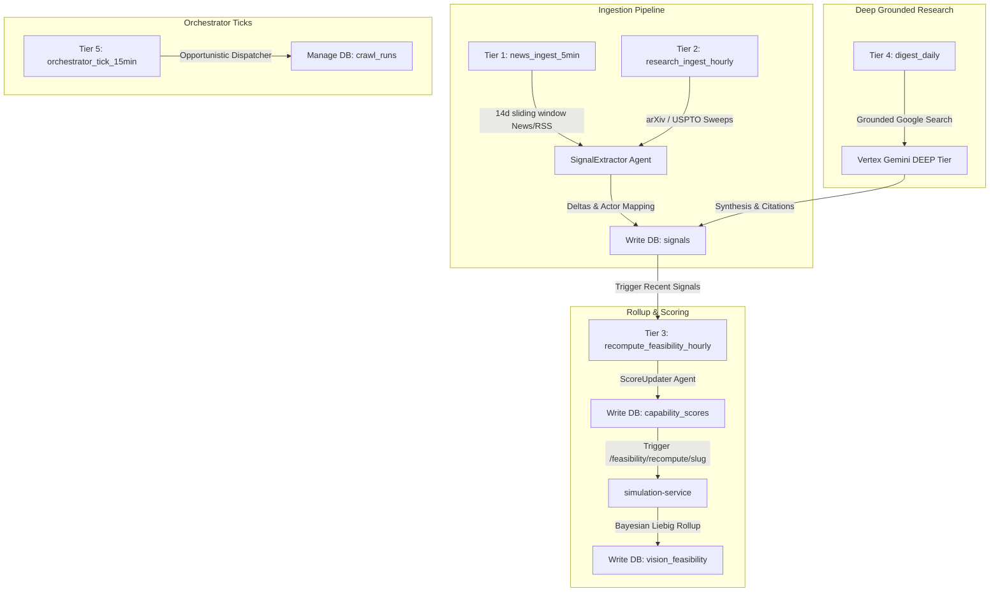

# 🚀 Sector Feasibility & Data Pipeline Architecture

This document outlines the core database entity relationships (ERD) and the underlying real-time asynchronous ingestion lifecycle driving the **Vision Feasibility Monitor** data-pipeline service.

---

## 1. Core Data Model & ERD Specifications

The database models and relationships derived from `schema.prisma` form a highly structured graph anchored around the central **Sector (Vision)** node.

### 📊 1.1 Core Entity Relationship Hierarchy (Pure Markdown Relation Map)

A clean, lightweight text-based representation of our database schema layout to ensure universal readability across markdown engines.

```text
[ Sector (Vision) ] ── (1:1) ── [ InvestmentThesis ]
       │
       ├─ (1:N) ── [ Capability ] 
       │                 │
       │                 ├─ (1:N) ── [ CapabilityScore (is_current) ]
       │                 ├─ (N:M) ── [ CapabilityDependency (DAG) ]
       │                 └─ (M:N) ── [ CapabilityActor ] ── (N:1) ── [ Actor ]
       │                                                                │
       ├─ (1:N) ── [ Signal (Evidence) ] ──────── (N:1, Optional) ──────┘
       ├─ (1:N) ── [ Risk (Blockers) ]
       ├─ (1:N) ── [ VisionFeasibility (Bayesian Rollup) ]
       ├─ (1:N) ── [ Catalyst (Milestone Schedules) ]
       ├─ (1:N) ── [ EconomicsDatapoint (Cost Curves) ]
       └─ (M:N) ── [ VisionActor (Key Players) ] ── (N:1) ── [ Actor ]
```

*   **1:N (One-to-Many)**: A single `Sector` controls multiple dependent `Capability`, `Signal`, `Risk`, `VisionFeasibility`, `Catalyst`, and `EconomicsDatapoint` time-series records.
*   **1:1 (One-to-One)**: A single `Sector` maps to precisely one `InvestmentThesis` Narrative.
*   **M:N (Many-to-Many)**: 
    *   Sectors and Actors map through the `VisionActor` join table.
    *   Capabilities and Actors map through the `CapabilityActor` join table.
*   **Self-Referencing N:M (DAG Structure)**: Capability-to-capability prerequisites are handled by the `CapabilityDependency` join table, forming a Directed Acyclic Graph.
*   **Optional N:1 (Nullable Foreign Keys)**: A `Signal` may optionally link to a specific `Capability` or a specific `Actor`. Nulls are permitted.

---

### 📋 1.2 Entity Definitions & Schema Details

A detailed dictionary of our main database tables, their physical schemas, constraints, and relationship mappings.

| Table (Prisma Model) | Domain Concept & Role | Key Columns (PK / FK / Unique) | Relationships | Constraints & Special Notes |
| :--- | :--- | :--- | :--- | :--- |
| **`Sector`** (`sectors`) | **Vision (Technology Bet)**<br>- The core technology question (e.g. "Will commercial fusion reach grid parity by 2040?"). | - **PK**: `id` (cuid)<br>- **Unique**: `slug` | - **1:N**: `Capability`, `Signal`, `Risk`, `VisionFeasibility`, `Catalyst`<br>- **1:1**: `InvestmentThesis` | - Gated by `is_vision_eligible` to toggles visibility in the Vision Monitor page.<br>- Addressed by `slug` globally. |
| **`Capability`** (`capabilities`) | **Prerequisite Capabilities**<br>- Key tech, economic, or regulatory capabilities required to make the vision a reality. | - **PK**: `id` (cuid)<br>- **FK**: `sector_slug` -> `Sector.slug`<br>- **Unique**: `[sector_slug, key]` | - **N:1**: `Sector`<br>- **1:N**: `CapabilityScore`, `Signal`<br>- **M:N DAG**: `CapabilityDependency`<br>- **M:N**: `Actor` (via `CapabilityActor`) | - Embeds a `signal_keywords` (String[]) array used directly by the ingestion pipeline as search query terms. |
| **`CapabilityScore`** (`capability_scores`) | **4-Dimension Score History**<br>- Chronological grading records measuring capability maturity. | - **PK**: `id` (cuid)<br>- **FK**: `capability_id` -> `Capability.id` | - **N:1**: `Capability` | - Tracks independent scores for `technical`, `economic`, `regulatory`, and `supply` dimensions.<br>- Rows where **`is_current = true`** represent the active current scores. |
| **`Signal`** (`signals`) | **Source Evidence (Events)**<br>- Fact-grounded events (academic paper, patent, news, filing) that nudge scores. | - **PK**: `id` (cuid)<br>- **FK**: `sector_slug` -> `Sector.slug`, `capability_id` (Null), `actor_id` (Null) | - **N:1**: `Sector`, `Capability` (Opt), `Actor` (Opt) | - Protected by **`@@unique([source_url, capability_id])`** to prevent duplicate scoring LLM cost and database pollution.<br>- Stores signed deltas ($\in [-10, +10]$). |
| **`Risk`** (`risks`) | **Risk Blockers**<br>- Orthogonal risk factors (political, financial, legal, safety) that could derail a vision. | - **PK**: `id` (cuid)<br>- **FK**: `sector_slug` -> `Sector.slug` | - **N:1**: `Sector` | - `affected_capability_keys` is kept as a denormalized string array to keep hero-aggregation queries cheap. |
| **`Actor`** (`actors`) | **Key Players**<br>- Real-world startup, lab, standard body, or conglomerate advancing capabilities. | - **PK**: `id` (cuid)<br>- **Unique**: `key` | - **M:N**: `Sector` (via `VisionActor`), `Capability` (via `CapabilityActor`) | - Optionally maps listed company price and ticker info via `ticker` and `exchange`. |
| **`VisionFeasibility`** (`vision_feasibility`) | **Bayesian Composite Score**<br>- Aggregated sector-level feasibility and ETA distributions. | - **PK**: `id` (cuid)<br>- **FK**: `sector_slug` -> `Sector.slug` | - **N:1**: `Sector` | - Pre-computes overall `composite`, `p10`, `p90` bands, and `eta_median_years`. |
| **`CrawlRun`** (`crawl_runs`) | **Pipeline Runs & Telemetry**<br>- Immutable record of crawler/extractor executions and spend. | - **PK**: `id` (cuid) | - *No Foreign Keys* (Retained in case other entities delete) | - Records LLM metered cost (`cost_usd`) and raw signals written. Drives the admin crawler cockpit health graphs. |
| **`JobConfig`** (`job_configs`) | **Dynamic Scheduler Configuration**<br>- Environment variables, schedules, and pipeline thresholds. | - **PK**: `key` (VARCHAR) | - *Independent Settings Table* | - **Enables dynamic runtime tuning of scheduler intervals and job params directly via SQLAdmin** without restarting Docker. |

---

## 2. Data Ingestion & Update Lifecycles

Our asynchronous background ingestion consists of **five distinct execution tiers** managed by `APScheduler`. Every job parameter and schedule is backed by the `JobConfig` DB layer for seamless online modification.


*(Note: The flowchart above illustrates the high-level coordination between scheduled tasks.)*

---

## 3. Tiered Scheduled Jobs Breakdown

### 🌐 Tier 1: Fast-rotation News Ingest (`news_ingest_5min`)
*   **Interval**: Every 5 minutes (armed when `NEWSAPI_KEY` is present)
*   **Primary Sources**: Google News RSS (keywords-driven) or `crawl4ai` scrapers (Yahoo Finance, Naver, Finviz)
*   **Ingestion Window**: 14-day sliding window (`lookback_days = 14`)
*   **Execution Flow**:
    1. Pulls `signal_keywords` from capabilities mapped to active visions.
    2. Issues queries to RSS/news adapters and collects raw signals.
    3. **Deduplication**: Executes a database check `repo.signal_exists(raw.source_url, cap.id)`. If the URL exists, it is skipped immediately, **saving substantial LLM cost**.
    4. If unique, dispatches to the **SignalExtractor agent (Gemini Haiku/Fast tier)** to extract signed score deltas (`delta_*` $\in [-10, +10]$), highlight markers (`is_highlight`), and match `Actor` mentions.
    5. Commits the new Signal snapshot to the DB.

---

### 🎓 Tier 2: Academic Research & Patents Sweep (`research_ingest_hourly`)
*   **Interval**: Hourly at `:07` past (offset to reduce load clustering at `:00`)
*   **Primary Sources**: arXiv (Papers) and USPTO (US Patents, when `ENABLE_USPTO=1` is configured)
*   **Ingestion Window**: 7-day lookback (configurable via `RESEARCH_INGEST_LOOKBACK_DAYS`)
*   **Execution Flow**:
    - Academic papers and patents operate on slower publishing cycles. This tier shares the core `run_signal_ingest` codebase but utilizes custom academic scrapers to write deep technical signals.

---

### 🧮 Tier 3: Feasibility Recompute Pipeline (`recompute_feasibility_hourly`)
*   **Interval**: Hourly at `:25` past
*   **Primary Sources**: **Recent signals ingested within 7 days (Up to 100 limit)**
    - *Refactoring Note: Previously, this was hardcoded to 30 days and 50 signals. Running hourly Bayesian rollup loops with a 30-day window was highly redundant and computationally wasteful. We optimized the default lookback to 7 days and increased the safety ceiling limit to 100 signals.*
    - ***Admin Tuning**: Both `RECOMPUTE_WINDOW_DAYS` and `RECOMPUTE_LIMIT` parameters can now be tuned live via the port `8003` SQLAdmin dashboard `Job Configs` screen.*
*   **Execution Flow**:
    1. Gathers active capabilities and reads the current `CapabilityScore` record (`is_current=true`).
    2. Queries recently ingested signals up to the configured limit.
    3. Invokes the **ScoreUpdater agent (Gemini Sonnet/Balanced tier)** with the baseline scores and the cumulative signals list.
    4. If agent confidence is low (**< 0.5**) or all deltas are null, writes are skipped.
    5. Integrates new grades using our **Softened Liebig's Law of Minimums** aggregator:
       - **Formula**:
         $$\text{weighted\_mean} = \frac{\sum (Dimension \times Weight)}{\sum Weight}$$
         $$\text{composite} = \text{lowest} + 0.6 \times (\text{weighted\_mean} - \text{lowest})$$
         *(The worst-performing bottleneck dimension caps capability advancement, softened by a 60% weighted mean allowance)*
    6. Updates existing scores in a single transaction (`is_current = false` on legacy, `is_current = true` on new).
    7. Calls `simulation-service` POST `/feasibility/recompute/{slug}` to compute Bayesian composite feasibility scores and ETA window distributions.

---

### 📝 Tier 4: Grounded Research Daily Digest (`digest_daily`)
*   **Interval**: Once daily
*   **Execution Flow**:
    - Triggers a deep search sweep powered by **Vertex AI Grounded Gemini (DEEP/Pro tier)** with google search grounding.
    - Synthesizes deep sector summaries and writes them as high-value signals with nested reference `citations`.

---

### ⚙️ Tier 5: Orchestrator Dispatcher Tick (`orchestrator_tick_15min`)
*   **Interval**: Every 15 minutes
*   **Execution Flow**:
    - Evaluates running agent budgets to prevent cost overruns.
    - Distributes opportunistic crawler jobs and maintains current worker queues under `crawl_runs` telemetry.
