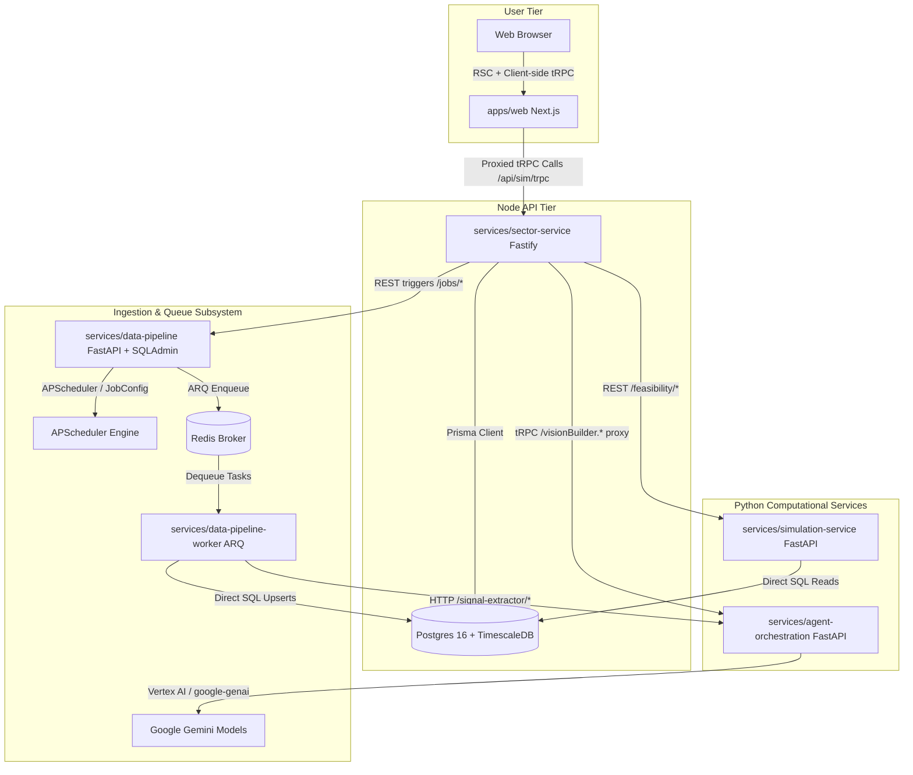
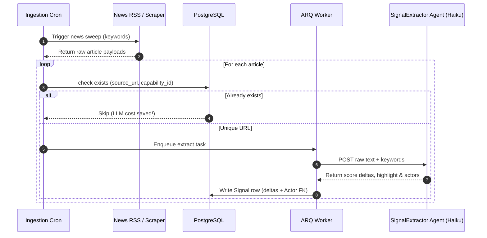

# 🏛️ Vision Feasibility Monitor System Architecture & Design

This document provides a highly detailed description of the system architecture, modular layout, component communication, and internal subsystems driving the **Vision Feasibility Monitor** (Phase 4 steady-state, post-M57).

---

## 1. Overall System Flow

The platform consists of a Next.js frontend and 4 dedicated backend services communicating via tRPC, REST APIs, and Redis-backed message queues.

---

## 2. Subsystem Architecture

### 2.1 Frontend (`apps/web`)
*   **Tech Stack**: Next.js 15 (App Router, RSC), TS strict, Tailwind CSS + shadcn/ui, Recharts, React Flow, TanStack Query, tRPC Client.
*   **Key Role**: Represents the user-facing dashboard at `/visions` and `/community`.
*   **Key Pages & Components**:
    *   `/visions` - Main dashboard showcasing the core technology visions (SDC, fusion, quantum, humanoid).
    *   `/visions/[slug]` - Tabbed layout (Overview / Capabilities / Actors / Signals / Risks / Economics / Playground / Sources) populated server-side via RSC and hydrated client-side.
    *   `/visions/[slug]/playground` - Client-side simulation dashboard leveraging a duplicate Liebig's Law composite formula in React for zero-latency updates.
    *   `/community` - Curation hub for `CommunityProposal` and tiered `PredictionV2` gaming.

### 2.2 Node API Gateway (`services/sector-service`)
*   **Tech Stack**: Fastify, tRPC, Prisma Client, PostgreSQL 16, bcryptjs.
*   **Key Role**: Serves as the single gatekeeper of state and database mutations. Re-exports the `AppRouter` used by `apps/web`.
*   **Core Routers**:
    *   `vision.*` - Coordinates vision details, investment theses, and milestone catalysts.
    *   `capability.*` - Read-write access to capabilities, dependency graphs (with cycle checking), and grading histories.
    *   `actor.*` - Read-write access to player mappings, player-capability roles, and signals tagged to actors.
    *   `proposal.*` - Directs community proposal submission, user voting, and approval logs.
    *   `predictionV2.*` - Manages predictions, user points ledger, and leaderboards.
    *   `vision-builder.*` - Coordinates the agentic flow by POSTing vague vision builder requests to `agent-orchestration` and executing the heavy multi-table transactional commit inside Prisma.

### 2.3 Feasibility & Simulation Engine (`services/simulation-service`)
*   **Tech Stack**: FastAPI, Uvicorn, NumPy, PyMC (stochastic projections), Pydantic v2.
*   **Key Role**: Owns the mathematical models driving feasibility composite scores, confidence bands, and ETA projections.
*   **Key Engine Components**:
    *   **Liebig's Law of Minimums Aggregator**: Combines the 4 dimensions (`technical`, `economic`, `regulatory`, `supply`) of a capability into a single grade. The lowest dimension acts as a binding cap, softened by a 60% weighted mean buffer:
        $$\text{composite} = \text{lowest} + 0.6 \times (\text{weighted\_mean} - \text{lowest})$$
    *   **Vision Feasibility Aggregator**: Executes a Bayesian rollup over the active capabilities of a vision, factoring in capability dependencies (DAG).
    *   **ETA Stochastic Forecaster**: Computes logistic regression projections over the historical feasibility time-series to estimate the median year and P10/P90 bands to cross the target threshold (80/100).

### 2.4 Ingest & Data Pipeline (`services/data-pipeline` + `data-pipeline-worker`)
*   **Tech Stack**: FastAPI, SQLAdmin (mounted at `/admin`), ARQ (Redis Worker), APScheduler, SQLAlchemy, SQLAlchemy Async, crawl4ai, Playwright.
*   **Key Role**: The operations cockpit and data ingest hub. Houses all fetchers, crawlers, and background crons.
*   **Dynamic Configuration (`JobConfig`)**: Instead of static `.env` variables, all crons, lookback windows (`RECOMPUTE_WINDOW_DAYS`), and signal caps (`RECOMPUTE_LIMIT`) are kept in the `job_configs` DB table. Admin can dynamically tune them live via the SQLAdmin dashboard at `data-pipeline:8003/admin` without restarting Docker.
*   **Fetchers & Workers**:
    - `data-pipeline-worker` runs the ARQ broker dequeuing task runs:
      - `CapabilityFetcher` / `ActorFetcher` / `RiskFetcher` / `SignalFetcher` (Direct adapters for arXiv / USPTO / News RSS) / `EconomicsFetcher`.
      - Evaluates LLM-grounded news synthesizers (`DeepResearchClient`) for daily digest synthesis.

### 2.5 Agent Orchestration (`services/agent-orchestration`)
*   **Tech Stack**: FastAPI, Pydantic v2, Vertex AI `google-genai` SDK, LLMClient.
*   **Key Role**: The intelligence coordinator. Controls all multi-stage Vertex Gemini agent workflows.
*   **Core Agent Workflows**:
    - **Vision Builder Conductor**: Natural-language prompt ➔ PromptValidator (fast) ➔ VisionResearch (balanced) ➔ VisionDecomposition (deep) ➔ DataSourceSelector (balanced) ➔ ValidationGate (non-LLM cycle & weight-sum verification).
    - **SignalExtractor Agent** (Fast tier, Haiku): Runs hourly on ingested news/RSS feeds. Screen raw texts to assign dim deltas ($\in [-10, +10]$) and tags Actor mentions.
    - **ScoreUpdater Agent** (Balanced tier, Sonnet): Runs daily per capability. Evaluates recent signals inside the lookback window to write new `CapabilityScore` rows.

---

## 3. Critical Data Flows & Deduplication

### 3.1 Real-time Signal Ingestion Cycle
To keep LLM API spending under strict thresholds ($2/day default per vision), the ingestion cycle enforces multi-level caching and database-level deduplication:

### 3.2 Dynamic Job Tuning View
Under M57, the administrative lifecycle for changing crawler/scoring behaviors behaves as follows:

1. **Seed on lifepan**: On boot of the `data-pipeline` service, SQLAlchemy validates the `job_configs` table, seeding missing fields from `.env` defaults.
2. **Admin Edits**: The administrator opens `data-pipeline:8003/admin`, goes to the **Job Configs** view, and edits `RECOMPUTE_WINDOW_DAYS=7` or `RECOMPUTE_LIMIT=100`.
3. **Immediate Action**: On the next hourly cron tick (or on manual click "Run Now" from the Queue tab), the scheduled runner fetches the fresh configs using `job_config.get_typed("RECOMPUTE_WINDOW_DAYS", default=7, kind="int")`, and limits the Postgres query window without needing a docker restart.

---

## 4. LLM Auth & Tier Routing (Vertex AI Single-SA Model)

The platform enforces an abstraction over Vertex AI and AI Studio to ensure single-point cost metering and budget ceilings.

*   **Production Provider**: Vertex AI, using a single service-account JSON at `infra/secrets/vertex-ai-sa.json`.
*   **Model Routing Map** (`packages/agent-tools/llm_client.py`):
    - **`fast`** (`gemini-3.1-flash-lite` / `gemini-3.5-flash-lite` fallback): Used for signal screeners, keyword extraction, and proposal drafting. Budget effort is 0.
    - **`balanced`** (`gemini-3.5-flash`): Used for vision research briefs, thesis drafting, and daily score updating. Budget effort is 1024.
    - **`deep`** (`gemini-3.1-pro-preview`): Used for multi-stage vision decomposition, capability dependency graph planning, and code review. Adaptive thinking budget is 4096 (high-effort).
*   **Structured Output Constraint Compiler**: When Pydantic models are too complex for Vertex's compiler (over 5888 states), the LLM client automatically falls back to JSON Schema injection inside prompt instructions, runs post-validations, and corrective re-prompts on failure.

---

## 5. Security & Isolation Boundaries

1.  **Scoring Code Sandbox**: High-risk python scripts generated by agents to score capabilities are restricted from running directly on the host. They are executed inside isolated **E2B / Modal** secure network-whitelisted containers (M28b).
2.  **Admin Action Auditability**: Any administrative actions (approve proposal, trigger deep research run, adjust job configurations) write an immutable log in `AuditLog` (`audit_logs`) documenting the payload snapshot before and after the change.
3.  **Database Scoping (RLS / Multi-tenancy)**: Multi-tenancy is deferred (M30), but the schema includes structural placeholders (`tenant_id` scopes) and PG Row-Level Security is prepared at the schema boundary to enforce client-scoped borders.
