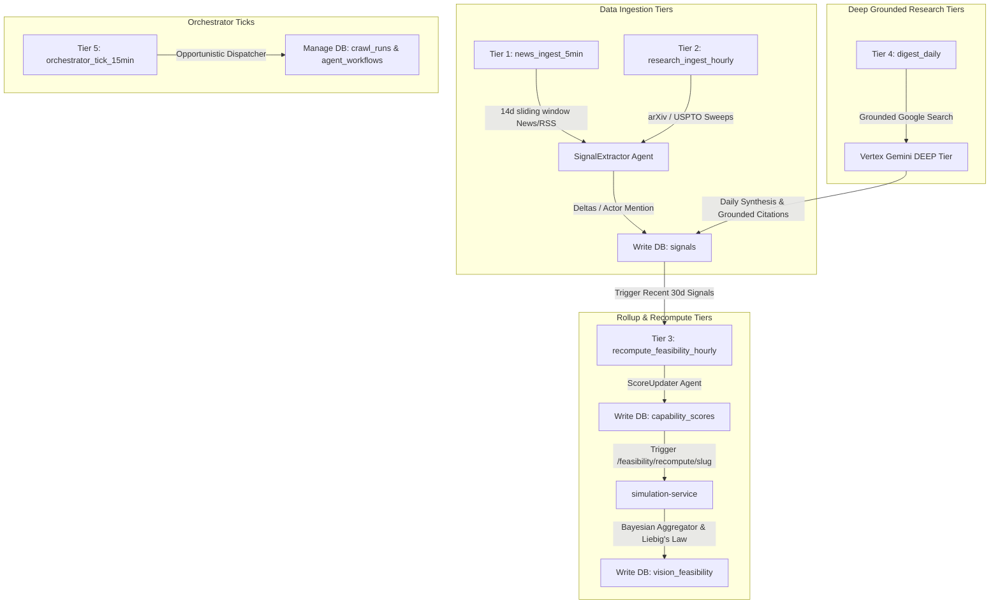

# 🚀 Sector Feasibility & Data Pipeline Architecture

본 문서는 기술 비전(Vision)의 실현 가능성을 모니터링하는 **Vision Feasibility Monitor**의 핵심 데이터 모델 구조(ERD)와, 이를 뒷받침하는 **실시간 데이터 파이프라인(Data Pipeline) 서비스**의 주기적 적재 및 업데이트 수집 아키텍처에 대한 상세한 분석서입니다.

---

## 1. 핵심 데이터 모델 및 ERD 명세

데이터베이스 스키마(`schema.prisma`) 분석을 바탕으로 도출한 데이터 모델 명세입니다. **Vision(Sector)**을 기점으로 한 핵심 테이블 간의 구조화된 관계(Relationship) 및 스키마 정보를 일목요연하게 마크다운 표로 제공합니다.

### 📊 1.1 핵심 엔티티 간의 마크다운 관계 맵 (Pure Markdown Relation Map)

데이터베이스 모델들 간의 관계를 순수 마크다운 텍스트만을 활용하여 명확하게 시각화하였습니다.

```text
[ Sector (Vision) ] ── (1:1) ── [ InvestmentThesis ]
       │
       ├─ (1:N) ── [ Capability ] 
       │                 │
       │                 ├─ (1:N) ── [ CapabilityScore (최신 점수) ]
       │                 ├─ (N:M) ── [ CapabilityDependency (DAG) ]
       │                 └─ (M:N) ── [ CapabilityActor ] ── (N:1) ── [ Actor ]
       │                                                                │
       ├─ (1:N) ── [ Signal (외부 증거) ] ────── (N:1, Optional) ───────┘
       ├─ (1:N) ── [ Risk (저해 요소) ]
       ├─ (1:N) ── [ VisionFeasibility (Bayesian 합산) ]
       ├─ (1:N) ── [ Catalyst (마일스톤 일정) ]
       ├─ (1:N) ── [ EconomicsDatapoint (단가 정보) ]
       └─ (M:N) ── [ VisionActor (주체 플레이어) ] ── (N:1) ── [ Actor ]
```

*   **1:N (일대다 관계)**: `Sector` → `Capability`, `Signal`, `Risk`, `VisionFeasibility`, `Catalyst`, `EconomicsDatapoint`
*   **1:1 (일대일 관계)**: `Sector` ↔ `InvestmentThesis`
*   **M:N (다대다 관계)**: 
    *   `Sector` ↔ `Actor` (매개 테이블 `VisionActor`를 통해 해소)
    *   `Capability` ↔ `Actor` (매개 테이블 `CapabilityActor`를 통해 해소)
*   **자기 참조 N:M (DAG 의존성 그래프)**: `Capability` ↔ `Capability` (매개 테이블 `CapabilityDependency`를 통해 해소)
*   **선택적 N:1 관계**: `Signal` → `Capability` (Nullable FK), `Actor` (Nullable FK)


### 📋 1.2 마크다운 기반 테이블별 상세 스키마 및 관계 표 (Relationship Table)

각 엔티티의 고유 역할, 핵심 필드, 릴레이션 및 제약 조건을 마크다운 테이블로 정리하여 직관적인 파악이 가능하게 하였습니다.

| 테이블명 (Prisma 모델) | 논리적 개념 (물리적 역할) | 핵심 필드 (PK / FK / Unique) | 타 엔티티와의 관계 (Relation) | 제약 조건 및 특이 사항 (Constraints & Notes) |
| :--- | :--- | :--- | :--- | :--- |
| **`Sector`** (`sectors`) | **Vision (기술 비전)**<br>- "Will commercial fusion reach grid parity?"와 같은 원대한 기술 질문 | - **PK**: `id` (cuid)<br>- **Unique**: `slug` | - **1:N**: `Capability`, `Signal`, `Risk`, `VisionFeasibility`, `Catalyst`<br>- **1:1**: `InvestmentThesis` | - `is_vision_eligible`을 통해 Vision Monitor 노출 여부 분기 관리<br>- UI 및 파이프라인 전반에서 `slug`로 참조됨 |
| **`Capability`** (`capabilities`) | **세부 능력 요건**<br>- 비전 달성을 위해 필요한 기술/정치/공급망 세부 능력 | - **PK**: `id` (cuid)<br>- **FK**: `sector_slug` -> `Sector.slug`<br>- **Unique**: `[sector_slug, key]` | - **N:1**: `Sector`<br>- **1:N**: `CapabilityScore`, `Signal`<br>- **M:N DAG**: `CapabilityDependency`<br>- **M:N**: `Actor` (via `CapabilityActor`) | - `signal_keywords` (String[]) 배열 필드를 내장하여 데이터 수집 키워드로 직접 활용<br>- `display_order`로 카드 정렬 순서 제어 |
| **`CapabilityScore`** (`capability_scores`) | **4대 차원 평점 시계열**<br>- 각 Capability의 성숙도를 시간 경과에 따라 평가 | - **PK**: `id` (cuid)<br>- **FK**: `capability_id` -> `Capability.id` | - **N:1**: `Capability` | - 4대 차원(`technical`, `economic`, `regulatory`, `supply`) 점수 보유<br>- **`is_current = true`**인 레코드가 활성 최신 점수 |
| **`Signal`** (`signals`) | **수집 증거 (이벤트)**<br>- arXiv 논문, USPTO 특허, 투자, 업계 뉴스 등 팩트 소스 | - **PK**: `id` (cuid)<br>- **FK**: `sector_slug` -> `Sector.slug`, `capability_id` -> `Capability.id` (Null), `actor_id` -> `Actor.id` (Null) | - **N:1**: `Sector`<br>- **N:1**: `Capability` (Optional)<br>- **N:1**: `Actor` (Optional) | - **`@@unique([source_url, capability_id])`** 복합 유니크로 중복 수집 완벽 방지<br>- 에이전트에 의해 평점 가감치(`delta_*` $\in [-10, +10]$) 판정 부여 |
| **`Risk`** (`risks`) | **달성 저해요인 (블로커)**<br>- 비전 실현을 방해할 독립적 위험 요소 | - **PK**: `id` (cuid)<br>- **FK**: `sector_slug` -> `Sector.slug` | - **N:1**: `Sector` | - `affected_capability_keys` (String[]) 비정규화 배열 필드로 영향받는 Capability 목록 조회 성능 최적화 |
| **`Actor`** (`actors`) | **시장 핵심 플레이어**<br>- 비전에 영향을 미치는 스타트업, 대기업, 연구소 등 실체 | - **PK**: `id` (cuid)<br>- **Unique**: `key` | - **M:N**: `Sector` (via `VisionActor`)<br>- **M:N**: `Capability` (via `CapabilityActor`) | - 주식 상장된 플레이어의 경우 `ticker`, `exchange` 연결 정보 보유<br>- `signal_keywords` (String[]) 기반 에이전트 자동 인식 맵핑 |
| **`VisionFeasibility`** (`vision_feasibility`) | **비전 실현 지표 스냅샷**<br>- 시뮬레이션을 거쳐 도출된 비전의 통합 달성률 시계열 | - **PK**: `id` (cuid)<br>- **FK**: `sector_slug` -> `Sector.slug` | - **N:1**: `Sector` | - 종합 점수(`composite`, `p10`, `p90`) 및 예측 달성 년수(`eta_median_years`) 포함<br>- `is_current = true`가 최신 지표 |
| **`CrawlRun`** (`crawl_runs`) | **데이터 파이프라인 이력**<br>- 수집기 및 에이전트의 실행 로그 및 텔레메트리 | - **PK**: `id` (cuid) | - *외래키 제약 없음* (고아 로그 보존 목적) | - `vision_slug`를 문자열 형태로 보유<br>- `fetcher_kind`별 `status`("queued"..."ok"), `cost_usd` (LLM 소모 예산) 등 로깅 |
| **`JobConfig`** (`job_configs`) | **동적 스케줄링 구성**<br>- 크론 표현식 및 온/오프 스케줄러 런타임 설정 저장소 | - **PK**: `key` (VARCHAR) | - *독립 설정 테이블* | - `group`별 분류 제공 (quotes, news_ingest 등)<br>- 관리자 콘솔에서의 동적 스케줄/조율 파라미터 실시간 갱신용 |

---

## 2. 데이터 파이프라인 수집 및 업데이트 라이프사이클

수집 파이프라인은 수집 주기와 데이터의 성격에 따라 5개의 **Tier**로 분류되는 주기적 스케줄링 작업을 통해 끊임없이 갱신됩니다. 스케줄러는 `APScheduler`에 의해 구동되며, 관리자가 `JobConfig` DB 테이블 설정을 변경하여 런타임에 실시간으로 제어할 수 있습니다.



---

## 3. 각 수집 작업(Cron Jobs)의 상세 분석

### 🌐 Tier 1: fast-rotation News Ingest (`news_ingest_5min`)
*   **실행 주기**: 5분마다 실행 (Fast-Loop)
*   **주요 소스**: Google News RSS (기본값, 키워드 연계) 또는 crawl4ai 기반 주식 정보 사이트 (Yahoo Finance, Finviz, Naver Finance 등)
*   **수집 대상 윈도우**: 14일 슬라이딩 윈도우 (`lookback_days = 14`)
*   **작업 메커니즘**:
    1. 활성 비전들에 맵핑된 하위 `Capability`의 `signal_keywords` 데이터를 가져옵니다.
    2. 키워드 쿼리를 구글 뉴스 RSS 혹은 뉴스 어댑터에 던져 관련 뉴스 소스들을 수집합니다.
    3. `repo.signal_exists(raw.source_url, cap.id)`를 통해 이미 DB에 유니크 키로 기록되어 있는 URL인지 1차 필터링합니다. (중복 유입 차단을 통한 **LLM 호출비 절감 효과**)
    4. 중복되지 않은 새로운 시그널에 대해서만 `agent-orchestration`의 `/signal-extractor/score` 엔드포인트를 통해 **SignalExtractor 에이전트(Haiku 티어)**를 호출합니다.
    5. 에이전트는 뉴스를 기반으로 4대 평가 차원 점수 변동량(`delta_technical`, `delta_economic`, `delta_regulatory`, `delta_supply` $\in [-10, +10]$)과 본문에 매칭된 `Actor` 식별 및 하이라이트 여부(`is_highlight`)를 도출합니다.
    6. 도출된 델타 정보를 결합하여 `signals` 테이블에 `upsert` 형태로 영구 적재합니다.

---

### 🎓 Tier 2: Research & Patent Ingest (`research_ingest_hourly`)
*   **실행 주기**: 매시 7분 (매시 정각 로드 클러스터 분산을 위한 7분 오프셋)
*   **주요 소스**: arXiv (논문), USPTO (미국 특허, `ENABLE_USPTO=1` 설정 시 가동)
*   **수집 대상 윈도우**: 7일 lookback (`lookback_days = 7`, 환경변수 제어 가능)
*   **작업 메커니즘**:
    - 연구/특허 발표의 느린 라이프사이클 주기에 맞춘 최적화 패스입니다.
    - Tier 1 뉴스 인프라와 동일한 `run_signal_ingest` 공통 코드를 타되, arXiv 및 특허 어댑터를 로드하여 고밀도 기술 시그널을 추출해냅니다.

---

### 🧮 Tier 3: Feasibility Recompute Pipeline (`recompute_feasibility_hourly`)
*   **실행 주기**: 매시 25분
*   **주요 소스**: 최근 7일 내에 적재된 `signals` 데이터 (최대 100개 한도, **기본값이며 SQLAdmin `feasibility` 그룹에서 동적 조정 가능**)
*   **작업 메커니즘**:
    1. 활성화된 비전들의 하위 Capability와 현재의 최신 `CapabilityScore` (단일 레코드)를 조회합니다.
    2. 최근 7일(또는 설정값) 동안 해당 Capability에 쌓인 누적 시그널 델타 세트(최대 100개 한도)를 추출합니다.
    3. `agent-orchestration`의 `/capability-score-updater/score` 엔드포인트를 호출하여 **ScoreUpdater 에이전트(Sonnet + Adaptive Thinking 티어)**를 구동합니다.
    4. 에이전트는 누적된 시그널들의 델타 값과 기존 베이스 점수를 종합 분석하여 새로이 갱신되어야 할 4차원 평점과 평점 부여 사유(`rationale`), 신뢰도(`confidence`)를 반환합니다.
    5. 에이전트가 제시한 신뢰도가 **0.5 미만**(`_MIN_CONFIDENCE_TO_WRITE = 0.5`)이거나 새로운 평점 변동이 없을 경우 점수 업데이트는 안전하게 스킵됩니다.
    6. 갱신 대상 점수는 아래의 **Liebig's Law (리비히의 최소량 법칙) 완충 공식**을 바탕으로 composite 점수를 수치화합니다.
       - **composite 계산 공식**:
         $$\text{weighted\_mean} = \frac{\sum (Dimension \times Weight)}{\sum Weight}$$
         $$\text{composite} = \text{lowest} + 0.6 \times (\text{weighted\_mean} - \text{lowest})$$
         *(가장 지체되는 최악의 병목 차원 점수가 전체 기술 능력을 대변하되, 가중치 평균을 60% 수준 완충 처리하여 종합 점수를 도출)*
       - **오차 범위 집계 (p10, p90)**:
         $$\text{half\_band} = \frac{\text{highest} - \text{lowest}}{4.0}$$
         $$\text{p10} = \text{composite} - \text{half\_band}, \quad \text{p90} = \text{composite} + \text{half\_band}$$
    7. 기존의 `CapabilityScore` 테이블 내 `is_current = true` 레코드를 `false`로 격하시키고 신규 스냅샷을 `is_current = true` 상태로 트랜잭션 인서트합니다.
    8. 마지막으로 `simulation-service`의 POST `/feasibility/recompute/{slug}` API를 트리거하여, 각 비전 차원에서의 Bayesian 결합 연산을 완성하고 `VisionFeasibility` 스냅샷 레코드를 적재하고 ETA를 업데이트합니다.

---

### 📝 Tier 4: Grounded Research Digest Pipeline (`digest_daily`)
*   **실행 주기**: 1일 1회 (Deep-Loop)
*   **작업 메커니즘**:
    - 매 회당 **Vertex AI Grounded Gemini (DEEP/Pro 티어)**를 한 차례 직접 태워 Google Search 그라운딩(실시간 검색 증빙)을 활용한 딥 리서치를 수행합니다.
    - 비전마다 한 개의 집약적인 딥 리서치 종합 시그널을 생성하고, 증빙된 상세 출처 리스트(`citations`: `[{url, title}, ...]`)를 데이터화하여 `signals` 테이블에 저장합니다.
    - 리서치 수행 시 생성된 로그 및 지출 비용은 `CrawlRun` 텔레메트리 테이블에 기록되어 관리자 대시보드에 투명하게 노출됩니다.

---

### ⚙️ Tier 5: Orchestrator Tick & dispatching (`orchestrator_tick_15min`)
*   **실행 주기**: 15분마다 실행
*   **작업 메커니즘**:
    - `agent-orchestration`의 주기적인 에이전트 행동 스케줄링과 백그라운드 크롤러 분기 태스크들을 디스패치(`dispatch_tick`)하는 하이퍼바이저 역할을 담당합니다.
    - 예산 한도를 모니터링하여 초과 예산 소모가 발생하는 무거운 크롤러 작업들을 스로틀링하고, 정상적인 주기적 작업 분배를 중재합니다.

---

## 4. 운용 및 신뢰성 제어 (Ops & Reliability)

1. **JobConfig 기반 동적 런타임 조정**:
   - `.env` 수정 및 컨테이너 재부팅이라는 번거로운 인프라 개입 없이, `JobConfig` 테이블에 적재된 cron 표현식이나 interval 파라미터를 DB 단에서 즉각 업데이트하는 것만으로도 APScheduler가 즉시 변경 사항을 무중단 반영합니다.
2. **비정상 실행 모니터링 (CronHistoryBuffer)**:
   - APScheduler의 `EVENT_JOB_ERROR`, `EVENT_JOB_MAX_INSTANCES`, `EVENT_JOB_MISSED` 등 주기적 작업 시 발생하는 핵심 이벤트들을 인메모리 큐 형태의 `CronHistoryBuffer`에 바인딩하여 관리자 UI에서 실시간으로 스케줄러의 헬스 상태를 확인할 수 있습니다.
3. **원자성 및 중복 방지 보장**:
   - 수집기와 적재 저장소 사이에 고유한 Prisma 유니크 제약(`@@unique`)을 둠으로써, 혹시 모를 다중 스케줄러 경쟁 상태(Race Condition)에서도 한 번 이상 중복된 데이터가 적재되어 불필요한 API 토큰 지출과 모델 점수 노이즈를 양산하지 않도록 멱등성(Idempotency) 설계가 완비되어 있습니다.
